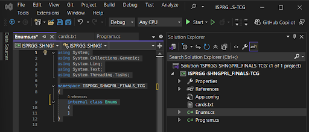
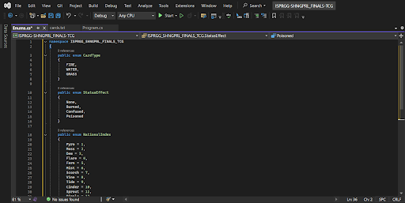
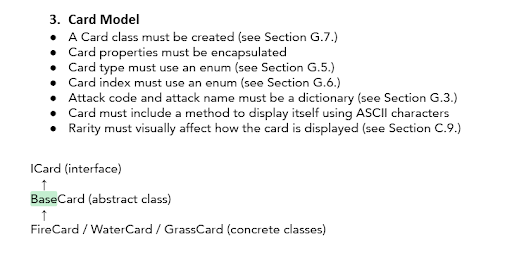
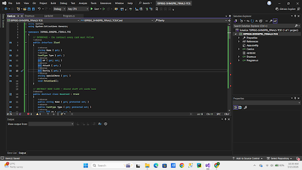
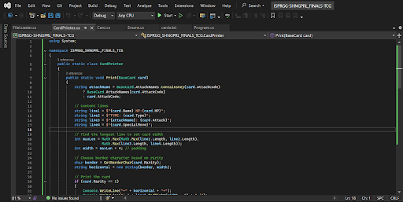
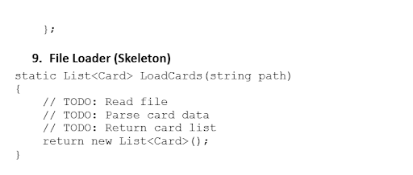
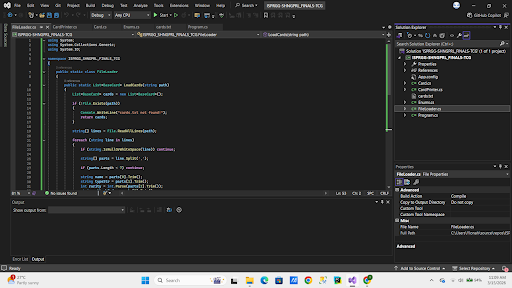

#### Dev Notes
> hi pu… below are the step by step procedures on what i did… nanghingi aq tulong sa other frens q kasi medj mahirap but dw ab it…
> im sorry in advance if medj chaotic aq mag explain but there wd be notes nmn throughout the steps. xx hope this helps mwa xx

anw i kinda divided the parts; i find the set-up pretty easy so i started it right away… basically here's what we need to achieve:

#### Overview
1. project set-up `[step 1 - step 2]`
2. card class + inheritance `[step 3 - step 4]`
3. file loader (i think nasama siya sa steps i js couldnt figure out where exactly but that's the cards.txt part)
   - (a) card print system
   - (b) card pulling system
   - (c) card binding system
4. battle mechanics
5. replay options + menu loop

> **note note note:** i have provided the exact texts so i suggest just ctrl f and search the key words
> para di kayo mahirapan, also refer on the pages :)) if there is something that needs to be changed,
> chat sa gc so we could all be informed.

---

#### Step 1: Project Set-Up — Copying the Cards (`cards.txt`)

created the file – did the requirement.

made a `.txt` file for cards (`cards.txt`) — edited its properties:
- **Copy Output Directory** → changed from `Do not copy` to `Copy Always`

so kapag ni-run yung program, magrrun siya from separate output folder. basically, every time you run
the program, Visual Studio automatically copies `cards.txt` into the `bin/Debug/` folder where the
program actually runs — so it can find and read it.

---

#### Step 2: Project Set-Up — Creating Enums (`Enums.cs`)

i made another `.cs` file and named it `Enums` as instructed sa docs given by sir *(pg 19)*





> **quickie note:** during this, i learned that itll be the same procedure over and over for creating cs
> file. i got confused lang a bit when i created a `.txt` file but i explained how i did it sa baba
> nmn… tnx pu >_<

---

#### Step 3: Creating Class Cards (`Card.cs`)

please refer to **pg 4 & pg 20** (class hierarchy and card class skeleton).

now we're moving on to connect both `cards.txt` & `Card.cs` (upon my understanding).

so the flow is:
```
cards.txt → FileLoader → Card objects → Game uses them
```

Class hierarchy to follow:
```
ICard (interface)
  └── BaseCard (abstract class)
        ├── FireCard
        ├── WaterCard
        └── GrassCard
```

#### Card Model Requirements *(pg 4)*
- A Card class must be created *(see E.7, pg 20)*
- Card properties must be encapsulated
- Card type must use an enum *(see E.5, pg 19)*
- Card index must use an enum *(see E.6, pg 19)*
- Attack code and attack name must be a dictionary *(see E.3, pg 18)*
- Card must include a method to display itself using ASCII characters
- Rarity must visually affect how the card is displayed *(see C.9, pg 8-11)*





i've copied the skeleton code provided on the pages i've mentioned above. however, for the description
naman ng cards; it'll be seen **pg 15** (E. student starter skeleton), i'm sure tama naman mga
pinaglalagay ko sa code itself since i just copied yung pang E.7 card class skeleton *c#*.

> **note:** the comments are included with the code, let's delete it na lang once we finalized our output.

---

#### Step 4: Creating Card Print System (`CardPrinter.cs`)

please refer to **pg 8-11** *(C.9 Card Print System)*.

ito na yung card display with diff borders w diff rarity level.



> **note:** pls tell me if may mali ba sa code since medj madami ako times here nag error :)

---

#### Step 4: Creating Card File Loader (`FileLoader.cs`)

please refer to **pg 21** *(E.9 File Loader Skeleton)*.

#### File Loader Skeleton *(pg 21)*
```csharp
static List<Card> LoadCards(string path)
{
    // TODO: Read file
    // TODO: Parse card data
    // TODO: Return card list
    return new List<Card>();
}
```



it reads each line of `cards.txt`, splits it by commas, and creates the right card type.

this func raw connects the `cards.txt` (which is the data/blueprint that defines each card) and `Card.cs`



---

> **quickie note:** i stopped sa file loader and we still have more stuff to do pa --- next one the
> card pulling system. but if you can download the files ill be uploading here so you could continue
> yourselves and para wag n mag start over, u can :))
